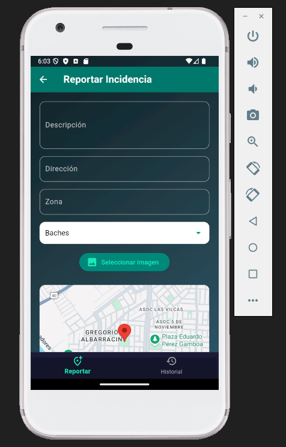
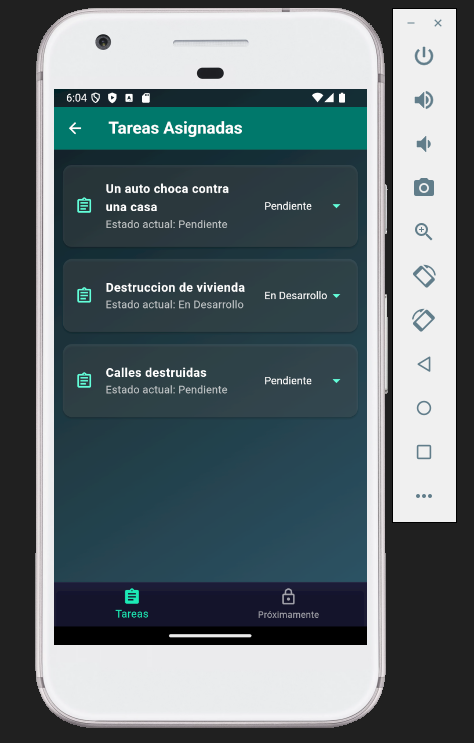
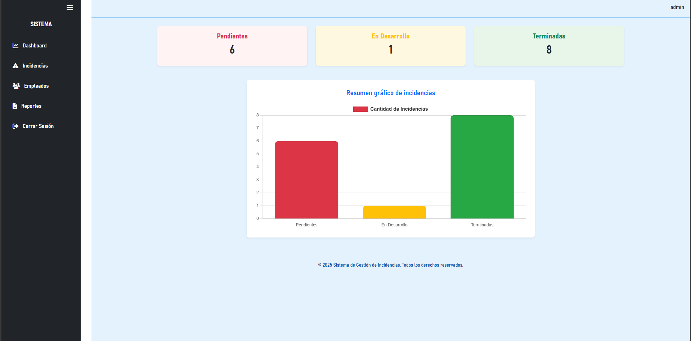
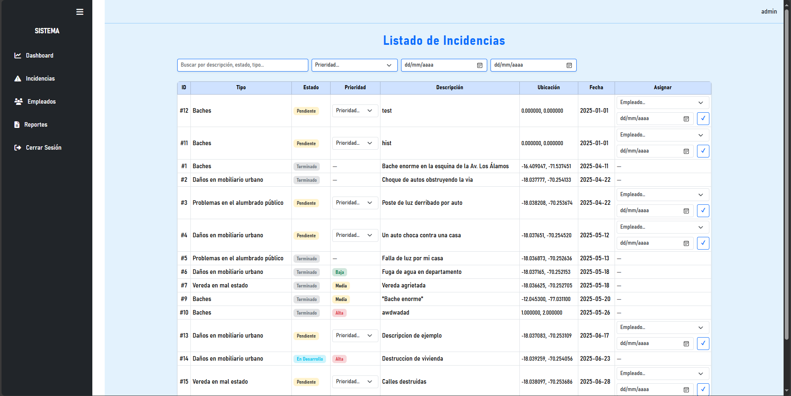

# 🛠️ Sistema Web de gestión de incidentes en infraestructuras basado en Crowdsourcing para el distrito Gregorio Albarracín Lanchipa

### INTEGRANTES:

Castañeda Centurión, Jorge Enrique (2021069822)

Hurtado Ortiz, Leandro (2015052384)

---
Este proyecto permite a los ciudadanos reportar incidencias urbanas desde una aplicación móvil desarrollada en Flutter, mientras que los administradores y empleados gestionan estos reportes desde un panel web desarrollado en PHP. El sistema está integrado con una base de datos PostgreSQL y cuenta con autenticación JWT y arquitectura Service Layer + MVVM.

---

## 📱 Aplicación Flutter (Ciudadano y Empleado)

### Funcionalidades:
- 📍 Reporte de incidencias con ubicación GPS
- 📷 Adjuntar imagen desde cámara o galería
- 📑 Visualización del historial por número de celular
- 🔒 Inicio de sesión para empleados
- 📋 Visualización de tareas asignadas
- 🔄 Actualización de estado de incidencias

### Capturas:
<div style="display: flex; gap: 10px;">
  
  
</div>

---

## 🌐 Panel Web PHP (Administrador)

### Funcionalidades:
- 🔐 Login seguro con JWT
- 📊 Dashboard de incidencias filtradas por estado
- 🧑‍💼 Asignación de empleados a tareas
- 📅 Programación de fechas de resolución (calendario)
- 📄 Generación de reportes PDF
- 📈 Visualización de estadísticas con gráficos

### Capturas:




---

## 🧩 Estructura del Proyecto
## Web PHP
### Frontend:
```
admin/
│
├── controllers/
│   ├── AuthController.php
│   ├── DashboardController.php
│   ├── EmpleadosController.php
│   ├── IncidenciasController.php
│   └── ReporteController.php
│
├── middleware/
│   └── protect.php
│
├── reporte/
│   ├── fpdf/
│   ├── debug_dataGrp.json
│   ├── debug_error.txt
│   ├── generar_excel.php
│   └── generar_pdf.php
│
├── views/
│   ├── auth/
│   │   ├── layout.php
│   │   ├── login.php
│   │   └── register.php
│   ├── partials/
│   │   ├── footer.php
│   │   ├── header.php
│   │   └── sidebar.php
│   ├── dashboard.php
│   ├── empleados.php
│   ├── incidencias.php
│   ├── layout.php
│   └── reporte.php
│
├── config.php
├── helpers.php
└── index.php

```

### Backend:
```
api/
│
├── public/
│   ├── admin_dashboard/
│   │   ├── asignar_incidencia.php
│   │   ├── empleados.php
│   │   ├── incidencias.php
│   │   ├── incidencias_por_empleado.php
│   │   ├── prioridad.php
│   │   ├── programar_fecha.php
│   │   ├── reporte_csv.php
│   │   ├── resumen_estadistico.php
│   │   ├── resumen_incidencias.php
│   │   └── tipos_incidencia.php
│   │
│   ├── api_ciudadano/
│   │   ├── listar_incidencias.php
│   │   ├── registrar_incidencia.php
│   │   ├── tipos_incidencia.php
│   │   ├── upload.php
│   │   └── validar_telefono.php
│   │
│   ├── api_empleados/
│   │   ├── actualizar_estado.php
│   │   ├── incidencias_asignadas.php
│   │
│   ├── login.php
│   ├── register.php
│   └── .htaccess
│
├── src/
│   ├── Controllers/
│   │   ├── AdminController.php
│   │   ├── CiudadanoController.php
│   │   ├── EmpleadoController.php
│   │   ├── IncidenciaController.php
│   │   ├── PrioridadController.php
│   │   └── ReporteController.php
│   │
│   ├── Core/
│   │   ├── Auth.php
│   │   ├── Database.php
│   │   └── Response.php
│   │
│   ├── Repositories/
│   │   ├── AdminRepository.php
│   │   ├── CalendarioRepository.php
│   │   ├── CiudadanoRepository.php
│   │   ├── EmpleadoRepository.php
│   │   ├── IncidenciaRepository.php
│   │   ├── PrioridadRepository.php
│   │   └── ReporteRepository.php
│   │
│   └── Services/
│       ├── AdminService.php
│       ├── CalendarioService.php
│       ├── CiudadanoService.php
│       ├── EmpleadoService.php
│       ├── IncidenciaService.php
│       ├── PrioridadService.php
│       └── ReporteService.php
│
└── bootstrap.php
```

## Flutter
### Estructura:
```
lib/
├── models/
│   ├── incidencia_model.dart
│   ├── tipo_incidencia_model.dart
│   └── usuario_model.dart
│
├── services/
│   ├── auth_service.dart
│   ├── incidencia_service.dart
│   └── incidencias_empleado_service.dart
│
├── viewmodels/
│   ├── detalle_incidencia_viewmodel.dart
│   ├── historial_viewmodel.dart
│   ├── login_viewmodel.dart
│   ├── phone_input_viewmodel.dart
│   ├── register_viewmodel.dart
│   ├── reportar_viewmodel.dart
│   └── tareas_viewmodel.dart
│
├── views/
│   ├── ciudadano_home.dart
│   ├── detalle_incidencia_screen.dart
│   ├── empleado_screen.dart
│   ├── historial_screen.dart
│   ├── login_screen.dart
│   ├── notification_screen.dart
│   ├── phone_input_screen.dart
│   ├── profile_screen.dart
│   ├── register_screen.dart
│   ├── reportar_screen.dart
│   ├── tareas_screen.dart
│   └── tasks_screen.dart
│
├── config.dart
└── main.dart
```

---

## ⚙️ Tecnologías y Herramientas

### PHP
- PHP 8+
- **Composer** 
- **PHPStan** (análisis estático de código – nivel máximo)
- JWT para autenticación
- Dotenv para variables de entorno
- PostgreSQL

### Flutter
- Flutter SDK 3.5.0
- Dart 3.5.4
- http (consumo de APIs REST)
- google_maps_flutter (integración de mapas)
- geocoding (obtención de ubicación GPS)
- image_picker (captura/selección de imágenes)
- provider (Arquitectura MVVM)
- flutter_test (pruebas funcionales)
- flutter analyze (análisis estático de código Dart)

---

## 🧪 Pruebas Realizadas

| Tipo de prueba          | Herramienta         | Estado       |
|-------------------------|---------------------|--------------|
| Funcionales UI/E2E      | `flutter_test`      | ✅ Completado |
| Pruebas Unitarias       | `PHPUnit` | ✅ Completado |
| Validación de formularios | `Flutter y PHP`   | ✅ Completado |
| Análisis estático PHP   | `PHPStan nivel máximo`    | ✅ Completado |
| Rendimiento             | `Apache Bench`      | ✅ Completado |

---

## 🚀 Instrucciones de instalación

### Clonar el proyecto

```bash
git clone https://github.com/epis-upt-flor/proyecto-final-teamjl.
cd proyecto-final-teamjl
```

---

## 🗄️ Base de Datos

- PostgreSQL con las tablas:
  - `usuario`
  - `ciudadano`
  - `incidencia`
  - `calendario_incidencia`
  - `estado_incidencia`
  - `historial_estado`
  - `tipo_incidencia`
  - `prioridad`

---

## 📌 Estado de Desarrollo

| Módulo / Requerimiento               | Estado        |
|--------------------------------------|---------------|
| RF-01 Reporte de incidencias         | ✅ Implementado |
| RF-02 Autenticación de Usuarios      | ✅ Implementado |
| RF-03 Roles de Usuario               | ✅ Implementado |
| RF-04 Monitoreo y Actualización de Incidencias       | ✅ Implementado |
| RF-05 Gestión del Dashboard          | ✅ Implementado |
| RF-06 Generación de Reportes         | ✅ Implementado |
| RF-07 Visualización de otras incidencias | ✅ Implementado |

---

## 📫 Contacto

Desarrollado por el equipo de desarrollo del proyecto académico.

**Correo**: jorcastaneda@upt.pe y lh2015052384@virtual.upt.pe   
**Teléfono**: +51 991 130 891 y +51 952 006 312
---
